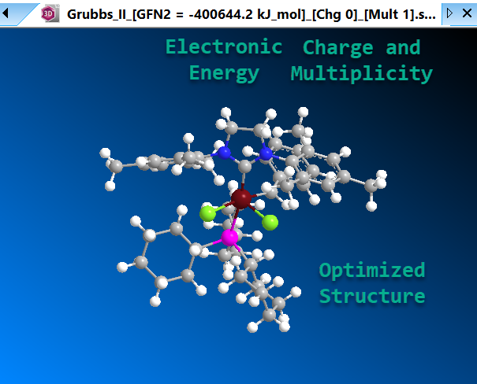
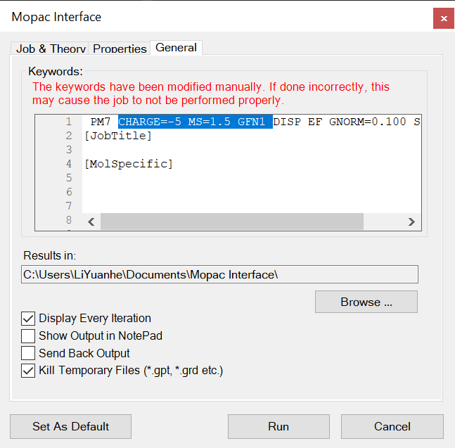
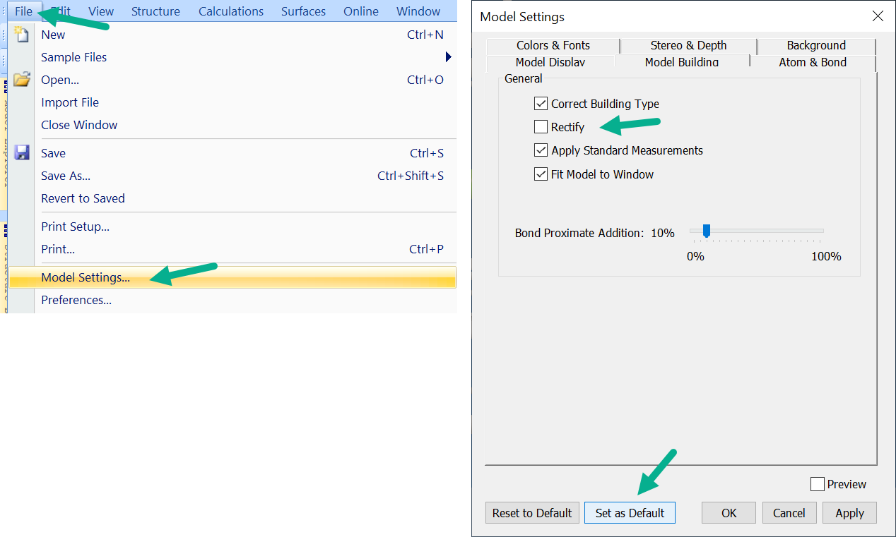

# xTB in Chem3D

## Download

[Download the installer](https://github.com/liyuanhe211/xTB_in_Chem3D/releases/download/0.1/xTB_in_Chem3D.0.1.exe).

## Features

The MM2 Optimization button in Chem3D is probably the most wildly used computational tool among chemists. However, it's often incorrectly interpreted by those who are not experts in computational chemistry, leading to misconceptions about its energy implications. Many fail to acknowledge its constraints, such as its inability to accommodate topology changes and the absence of parameters for different atom types.

This program integrates xTB optimization into Chem3D by repurposing the MOPAC menu. Upon the completion of the optimization process, the results, including the electronic energy, are displayed in Chem3D. This integration facilitates the use of xTB with minimal learning curve, and it is hoped to replace an obsolete force field that's over 50-years-old.

## How to use

* Confirm that `MOPAC in ChemDraw` is not a requirement for your work as it will be OVERWRITTEN.
* Install the program using the installer provided in the [release](https://github.com/liyuanhe211/xTB_in_Chem3D/releases/latest).
* Draw any structure in Chem3D, optionally optimize with MMFF94 or MM2.
* Navigate the menu: `Calculations` → `MOPAC Interface` → `Minimize` → `Run`.
* A CMD window will pop up, wait for the process to finish. Upon completion, the results will be displayed automatically:
  * The xTB output file will open in your chosen text file editor.
  * The structure's geometry will be displayed in Chem3D.
  * The electronic energy will be **indicated in the filename** in kJ/mol. 

* Video demonstration:

https://github.com/user-attachments/assets/5a562413-aa36-4d7d-9a75-e1283dfdc2e4

## Advanced options

Prior to running the job, specific keywords can be added to the "General" input tab of the MOPAC interface. For instance, the keyword shown below sets the charge to -5, the multiplicity to quartet, and use the GFN1 level of calculation:

### Setting charge

By default, Chem3D loads the sum of the formal charges given in the MM model into the MOPAC interface, with the keyword being `CHARGE=[FormalCharge]`, if this is not desired, you can change it to an integer like `CHARGE=-5`.

### Setting multiplicity 

By default, the program assigns singlet for even-electron systems, and doublet for odd-electron systems. 

For triplet or higher spin states, use the following keywords:
* `TRIPLET` for triplet.
* `MS=number` for arbitrary multiplicity. Use `MS=0.5` for doublet, `MS=1` for triplet, `MS=1.5` for quartet, etc.

### Setting level of calculation

By default, the program uses `GFN2`. 

To select different models, use the keywords `GFN1`, `GFN0`, or `GFNFF` in the general tab.

## Handling xTB Errors

If xTB terminates unexpectedly, the program will display `xTB calculation failed.` This indicates an issue within the xTB program. It is not a problem with the interface.

## File locations

All input and output files are stored in the `Document/xTB_in_Chem3D` folder within the user directory.

## Uninstall

* Use the included uninstaller in `C:\Program files\MOPAC`
* Alternatively, delete the `C:\Program files\MOPAC` folder manually.

## Known Issue

* Chem3D fails to open the output file after calculation completion:

If this issue only occurs occasionally, it may be due to Windows' slow response to the "bring window to front" command. The output file's path will be shown in the command line window, allowing you to open it manually.

If this problem persists, consider using a screen recording software like `ocam` to record the issue and report it as a bug.

* Incorrect bonding topology:

This is not an issue. The bond order between two atoms is an artificial concept that cannot be experimentally measured. The definition becomes ambiguous when transitioning from MM to xTB. One should focus on the distance between atoms instead. A more detailed discussion about this issue can be found [here](http://sobereva.com/414). 

* Extra hydrogen atoms when opening output files

Chem3D have an automatic rectification feature that adds hydrogen atoms where it deems appropriate, resulting in the display of extra hydrogens where they don't actually exist. 

This function can be disabled by navigating the menu: `File` → `Model Settings` → `Model Building`  → `Rectify` and selecting `Make as Default`.

## Version History

### 0.1

Initial Commit.
* Interface has been tested.
* The program can now read geometry, keyword, and filename from .mop files.
* Multiplicity can be set using `TRIPLET` and `MS`.
* Level selection has been enabled with `GFN0`, `GFN1`, `GFN2`, `GFNFF`.
* Computational level has been added to output file name, formatted as \[GFN2 = energy\].
* Charge and multiplicity have been added to the output file name.
* An installer has been created.
* Connectivity recognition has been improved by converting gjf files to sdf files using OpenBabel.