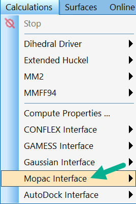

# xTB in Chem3D

## Download

[Download the installer](https://github.com/liyuanhe211/xTB_in_Chem3D/releases/download/0.2/xTB_in_Chem3D.0.2.exe)

## Requirement

You need to have `MOPAC Interface` in the `Calculations` menu of your ChemDraw. 

If you don't have `MOPAC Interface` in the `Calculations` menu, you need to install the "**Ultra**" version of Chem3D. The other versions don't have the MOPAC interface. 

The program was tested on `Chem3D 22.0.0.22 Ultra (2022)`.

## Features

**Video demonstration** ([link](https://www.youtube.com/watch?v=yJqBK2eKTwA)):

  

The `MM2 Optimization` tool in Chem3D is probably the most wildly used computational tool among chemists. However, it's often incorrectly interpreted by those who are not experts in computational chemistry, leading to misconceptions about its energy implications. Many fail to acknowledge its constraints, such as its inability to accommodate topology changes and the absence of parameters for different atom types.

This program integrates xTB optimization into Chem3D by repurposing the MOPAC menu. Upon the completion of the optimization process, the results, including the electronic energy, are displayed in Chem3D. This integration facilitates the use of xTB with minimal learning curve, and it is hoped to replace an obsolete force field that's over 50-years-old.

## How to use

* Confirm that `MOPAC in ChemDraw` is not a requirement for your work as it will be OVERWRITTEN.
* Install the program using the installer provided in the [release](https://github.com/liyuanhe211/xTB_in_Chem3D/releases/latest).
* Draw any structure in Chem3D, optionally optimize with MMFF94 or MM2.
* Navigate the menu: `Calculations` → `MOPAC Interface` → `Minimize` → `Run`.
* A CMD window will pop up, wait for the process to finish. Upon completion, the results will be displayed automatically:
  * The xTB output file will open in your chosen text file editor.
  * The structure's geometry will be displayed in Chem3D.
  * The electronic energy will be **indicated in the filename** in kJ/mol. 

* A panel will appear after the optimization featuring push buttons for frontier molecular orbital, each with its energy level. By clicking on any of these buttons, and wait a few seconds (the progress will be shown in the text output widget), the corresponding molecular orbital can be displayed within Chem3D.

## Options

Prior to running the job, specific keywords can be added to the "General" input tab of the MOPAC interface. For instance, the keyword shown below sets the charge to -5, the multiplicity to quartet, and use the GFN1 level of calculation:

### Single point calculation

By default, the program runs an xTB optimization. By adding `SP` to the keyword, the program runs a single point calculation, which could be useful if you wish to obtain information for certain geometries.

### Setting charge

By default, Chem3D loads the sum of the formal charges given in the MM model into the MOPAC interface, with the keyword being `CHARGE=[FormalCharge]`, if this is not desired, you can change it to an integer like `CHARGE=-5`.

### Setting multiplicity 

By default, the program assigns singlet for even-electron systems, and doublet for odd-electron systems. 

For triplet or higher spin states, use the following keywords:
* `TRIPLET` for triplet.
* `MS=number` for arbitrary multiplicity. Use `MS=0.5` for doublet, `MS=1` for triplet, `MS=1.5` for quartet, etc.

### Setting level of calculation

By default, the program uses `GFN2`. 

To select different models, use the keywords `GFN1`, `GFN0`, or `GFNFF` in the general tab.

## Handling xTB Errors

If xTB terminates unexpectedly, the program will display `xTB calculation failed.` This indicates an issue within the xTB program. It is not a problem with the interface.

## File location

All input and output files are stored in the `Document/xTB_in_Chem3D` folder within the windows user directory, for example, `C:\Users\LiYuanhe\Documents\xTB_in_Chem3D`. You may wish to periodically clean the folder if you generate lots of orbital cube files.

## Uninstall

* Use the included uninstaller in `C:\Program files\MOPAC`
* Alternatively, just delete the `C:\Program files\MOPAC` folder manually.

## Known Issue

* Chem3D fails to open the output file after calculation completion:

If this issue only occurs occasionally, it may be due to Windows' slow response to the "bring window to front" command. Click the `Reload Optimized Structure` button in the Orbital Viewer window.

* Incorrect bonding topology:

This is not an issue. The bond order between two atoms is an artificial concept that cannot be experimentally measured. The definition becomes ambiguous when transitioning from MM to xTB. One should focus on the distance between atoms instead. A more detailed discussion about this issue can be found [here](http://sobereva.com/414). 

* Extra hydrogen atoms when opening output files

This is not a problem with the input file generation or xTB calculation. The reason is Chem3D have an automatic rectification feature that adds hydrogen atoms where it deems appropriate. The extra hydrogen is only added when the output file is opened in Chem3D. This only happens to "unusual" structures like metal complexes, radicals, etc. 

This function can be disabled by navigating the menu: `File` → `Model Settings` → `Model Building`  → `Rectify` and selecting `Make as Default`. However do note that **this will affect other use cases**:

* Isovalue of orbitals

As Chem3D defaults isovalue = 0.002 for the isosurfaces, which is too small for most molecular orbitals, to avoid needing to change this value everytime an orbital is opened, the values of all of the voxels in the cube file were divided by 25 before sending it to ChemDraw.

## Version History

### 0.4

* TODO: Try to solve the Ctrl+O non-focus issue.

### 0.3

* Support single point calculation (without optimization) with `SP` keyword.
* Add `Load Output Structure in Chem3D` button in the Orbital Viewer window.
* Bugfix: Encoding problem when opening files.

### 0.2

* Show xTB molecular orbitals (for closed shell only). 
* Adjust MO cube values by multiplying with 0.04, such that the default Chem3D value of 0.002 becomes appropriate.

### 0.1.1

* Bugfix: OpenBabel reports missing MSVCP100.dll when the runtime is not installed. `vcredist_x86.exe` has been added to the installer.

### 0.1

Initial Commit.
* Interface has been tested.
* The program can now read geometry, keyword, and filename from .mop files.
* Multiplicity can be set using `TRIPLET` and `MS`.
* Level selection has been enabled with `GFN0`, `GFN1`, `GFN2`, `GFNFF`.
* Computational level has been added to output file name, formatted as \[GFN2 = energy\].
* Charge and multiplicity have been added to the output file name.
* An installer has been created.
* Connectivity recognition has been improved by converting gjf files to sdf files using OpenBabel.
